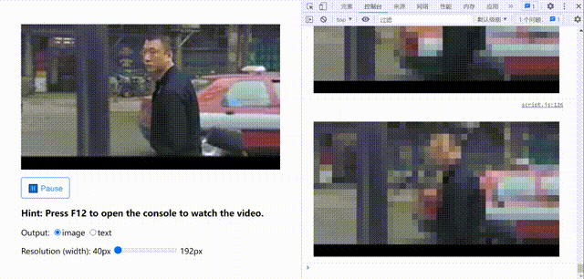

# Video in JavaScript Console
最近整的一个烂活，在 JavaScript 控制台中播放华强买瓜。

## 两种输出方式
### 文本 + CSS

这是最初的想法，思路与其他“控制台放视频”的项目类似，在控制台中打印文本并通过 CSS 调整每个字（方块）的颜色。如你所见，该方案性能非常差，估计是渲染文档的开销太大了。

注：闪烁为控制台清屏所致，若不定期清屏会因为控制台内容过多导致卡顿。

### 图片
既然控制台支持 CSS，那不如直接输出图片算了（好像有点作弊）。具体做法是，先在 canvas 上绘制马赛克式的图像，然后通过 `toDataURL` 拿到 URL，用这个 URL 作为 CSS 中的 `background` 属性。
